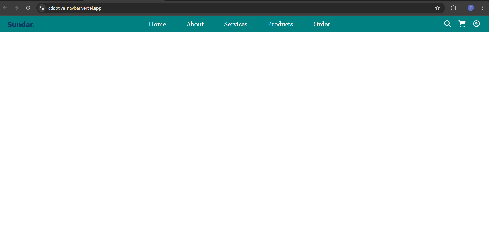
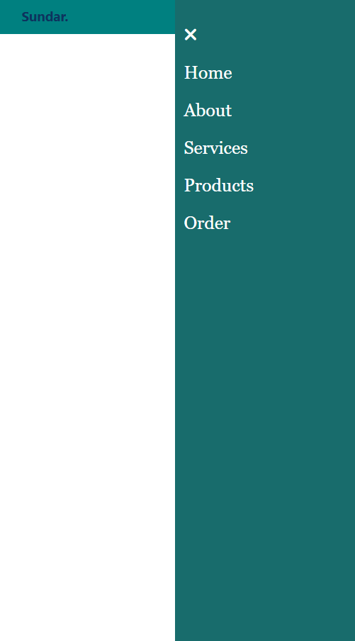

# adaptive-navbar

A fully responsive 🌐 navigation bar built with HTML, CSS, and JavaScript ⚙️.
Includes a mobile-friendly hamburger menu 🍔, smooth animations 🎨, and dynamic interaction 🎯.

## 🚀 Features
* Mobile-first design
* Toggle button opens/closes the menu
* Smooth transitions with `transform: translateX`
* Closes menu when a link is clicked using `forEach`

## 📂 Tech Stack
* 🧱 HTML5
* 🎨 CSS3 (with transitions)
* 🧠 JavaScript (DOM manipulation, forEach and events)

  ## 📷 Preview:

